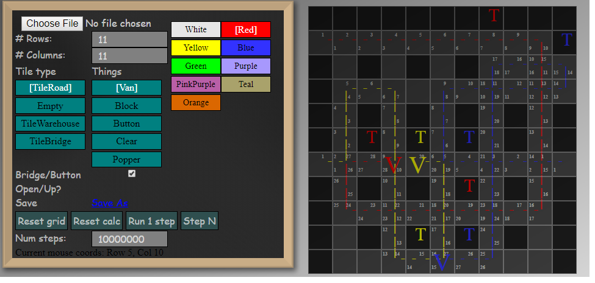

# A grid solver for [RGB Express](http://rgbexpress.com/)

## Components

### grid-editor

Angular front end, grid editor.

Language: TypeScript

### web_worker_build

Packages the WASM using a stand alone webpack as a Web worker.  Too much of a PITA to get angular cli
to play nicely.  Copies the output directly to angulars assets.

Language: TypeScript

### rgb-solver

WASM Source.  Unit tests run in x86 (or linux on travis)

Language: Rust